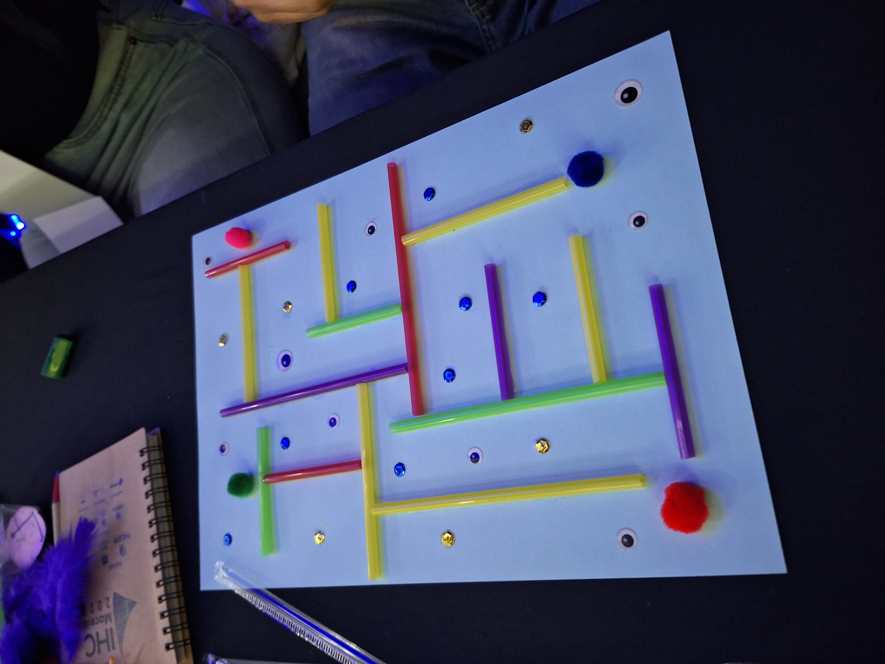
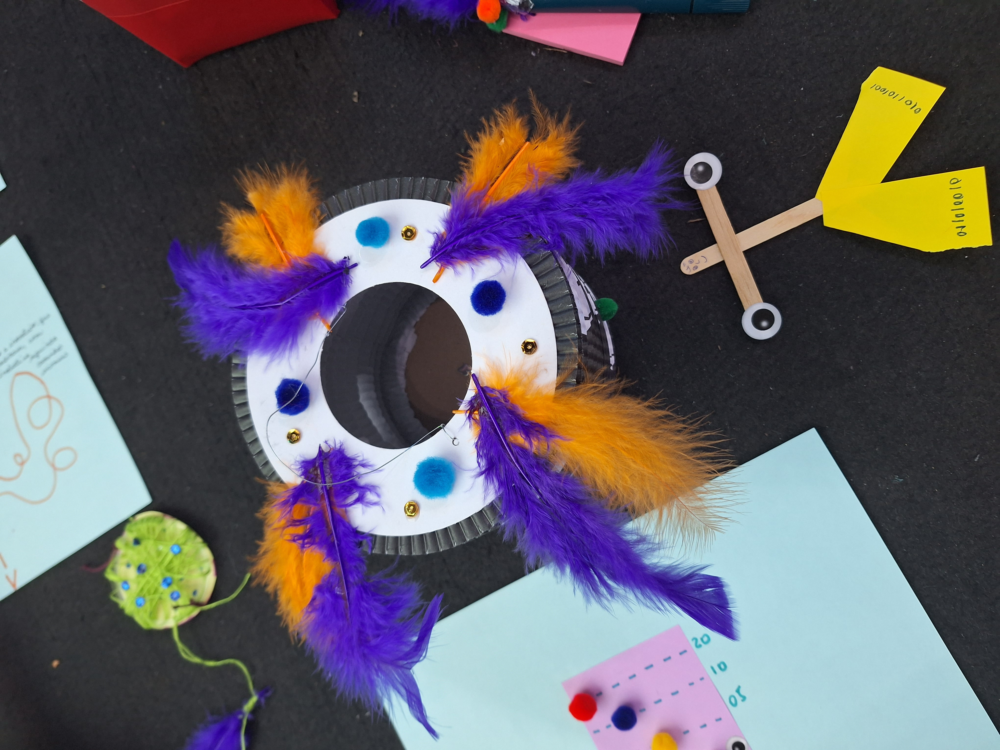
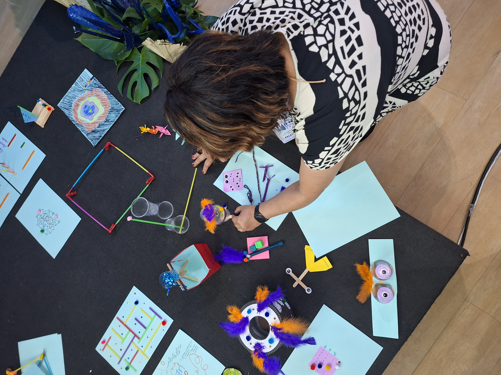

# Data Commons Initiative

Data Commons is a research project focused on data literacy in vulnerable communities, exploring participatory and situated approaches to data education.

## About

This project is part of a Ph.D research at UFRJ and investigates how communities engage with data through workshops, visual practices, and collective reflection, grounded in Popular Education.

## Methods

This project is inspired by the pedagogical principles of Paulo Freire, particularly as articulated in *Pedagogy of the Oppressed*, emphasizing creativity, critical consciousness, dialogue, and collective knowledge production.

It adopts participatory and co-design methods to collaboratively develop learning strategies with participants. These approaches are operationalized through creative workshops, where participants actively engage in the co-creation of data literacy practices and learning experiences.

<table align="center">
  <tr>
    <td></td>
    <td></td>
    <td></td>
  </tr>
</table>

## Early outputs

[Data Literacy Competencies Map](https://github.com/Lu-Brito/dataliteracy/blob/main/DataLiteracyScale.png)

[Research Papers & Book Chapters](https://scholar.google.com.br/citations?user=0CXXxe0AAAAJ&hl=pt-BR&authuser=1)

## SocialTech Lab (UFRJ)

The SocialTech Lab at UFRJ conducts research in Human-Computer Interaction (HCI) and Computer-Supported Cooperative Work (CSCW), with a strong focus on socially situated and community-driven technologies. The lab is particularly interested in how data practices can support expression, learning, and rights advocacy in socially vulnerable contexts. Its work emphasizes participatory and co-design approaches, engaging communities as active contributors throughout the research process. 

Projects developed within the lab often involve workshops, data literacy initiatives, and the creation of visual and material artifacts, such as data visualizations and photovoice outputs.

The lab brings together an interdisciplinary team, integrating perspectives from computing, design, education, and the social sciences, and is committed to bridging academic research with real-world impact.

## About me 

  

I am Lu Brito, an instructional designer working with the Government of Rio de Janeiro for over 10 years, and a PhD candidate at UFRJ. I am passionate about creating engaging, out-of-the-box learning experiences in collaboration with creative people committed to social causes. In my free time, I enjoy cycling, climbing, swimming in the ocean, and spending time with my black cat, the Cowboy :)

## Research Interests

- Human-Computer Interaction (HCI)  
- Computer-Supported Cooperative Work (CSCW)  
- Data Literacy  
- Socially vulnerable communities
- Race & Feminism
- Open Knowledge initiatives

## Contact

We love to discuss our research and also make friends. Feel free to [contact us](https://api.whatsapp.com/send?phone=5521987401692&text=Hi%20Luciana!%20Can%20we%20talk%20about%20your%20Data%20Literacy%20project?) or by my email [lubrito@ppgi.ufrj.br](lubrito@ppgi.ufrj.br) and have a cup of coffee. 
